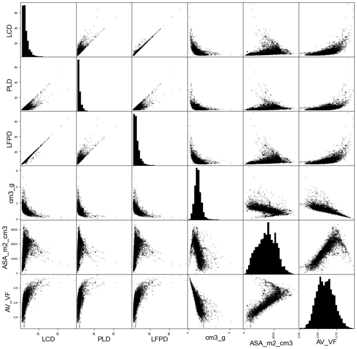

Examples
========================

The application of pySembrane is demonstrated through an example of membrane screening for green H$_2$ separation. Practical case studies performed with the package and discussion of the results illustrate how pySembrane can be beneficially applied across various research fields and emphasize the reliability and compatibility of the package.

.. image:: images/CasestudiesScheme.png
  :width: 700
  :alt: CasestudiesScheme
  :align: center

----------------------------------------------------------------------------------------------------------------------------------------------------------------------

.. toctree::
   :maxdepth: 2
   :caption: Contents:

   Example1
   Example2
   Example3
   

----

**Problem deifinition and process description**

For the optimal MOF selection of a green hydrogen production process, pySembrane is applied to three examples to show how to utilize pySembrane in actual problems, as shown in Figure \ref{fig:CasestudiesScheme}.
In recent years, there has been significant interest in green hydrogen, owing to its potential as an environmentally friendly alternative to traditional fuels  \cite{ChristenseN2006}. Simultaneously, green ammonia (NH$_3$) is gaining considerable attention as a transportation medium for hydrogen (H$_2$) \cite{Lamb2019a, ga2024economic}. Given that NH$_3$ already possesses well-established infrastructure for production, transportation, and storage, green H$_2$ generated from regions abundant in renewable energy sources, such as Australia, Saudi Arabia, Chile, and Argentina, can be efficiently transported over long distances to global markets in the form of NH$_3$, as illustrated in Figure \ref{fig:CasestudiesScheme}(a) \cite{Morlanes2021}. Ensuring the high purity of H$_2$ post-decomposition of transported green NH$_3$ is crucial to meet the required purity standards for various applications. Among the various technologies for refining H$_2$, the membrane-based gas separation process is in the spotlight for light gas separation owing to advantages such as high energy efficiency and ease of operation \cite{adhikari2006hydrogen, chae2022present}. However, due to significant performance variations in the membrane process depending on the material, selecting the optimal membrane requires thorough evaluation \cite{lv2022tailoring}. Thus, across the three examples, membrane materials undergo evaluation through stages—single metric, optimization, and plant scale—to ultimately determine the optimal MOF membrane for green H$_2$ separation.

In the first example, potential MOFs were selected based on the process performance of the numerous MOFs. Molecular and molecular dynamic simulations were performed to derive the membrane properties of each MOF, and then MOFs with purity exceeding 99.9\% were selected through the membrane process simulation. In the second example, the potential MOF selected in the previous step was analyzed in greater depth via process optimization. Given that both product purity and economic viability vary with process variables, the optimal MOF was identified by determining the best process conditions through economic analysis and optimization. In the last example, the performance of the best MOF selected in the previous step was analyzed at the plant scale. The plant-scale model, developed using Aspen Plus commercial software, was integrated with the membrane process model to evaluate the impact of process conditions on both the membrane process and the final product.

----------------------------------------------------------------------------------------------------------------------------------------------------------------------

**Database and pre-screening**

To find the most promising MOF, CoRE MOF 2019 database \cite{chung2019advances}, which contains 12,020 MOFs, was analyzed for membrane materials. Out of these MOFs, 450 were excluded because of the absence of structure files (.cif) required for subsequent molecular simulations. The database provides structural properties of MOFs such as accessible surface area (ASA\_m2\_cm3), void fraction (AV\_VF), the largest cavity diameter (LCD), pore limiting diameter (PLD), largest sphere along the free path (LFPD), and volume (cm3\_g), among others. The distribution and correlations of each property are depicted in Figure \ref{fig:CoREMOFvariables}.

Before evaluating MOFs as membrane materials through three examples, pre-screening is carried out for efficient assessment. Pre-screening consists of three stages: removal of inconsistent structures, elimination of MOFs containing precious metals, and structural-based screening. Initially, MOFs with disordered structures or containing precious metals were excluded. Disordered MOFs need to be removed since they represent physically implausible structures, despite being listed in the database. Secondly, MOFs containing precious metals were eliminated due to their impracticality in large-scale industrial applications, as their high costs render them unsuitable. Table \ref{tab:PreciousMetals} lists excluded precious metals \cite{ga2024multidisciplinary}. Lastly, the pore limiting diameter (PLD) represents the smallest pore diameter of a material, and if the PLD is smaller than the gas molecules, these gas molecules cannot penetrate the pores. As PLD is the most fundamental physical characteristic of a membrane, initial screening should be based on PLD values. In three examples, since the objective is to permeate the N$_2$/H$_2$ mixture through the membrane, the diameter of N$_2$ was selected as the threshold. Consequently, 6,086 MOFs with a PLD $\ge$ 3.31 were screened for further analysis.

+------------------+---------------+
| Chemical Symbols |     Name      |
+==================+===============+
|        Au        |     Gold      |
+------------------+---------------+
|        Ag        |    Silver     |
+------------------+---------------+
|        Pt        |   Platinum    |
+------------------+---------------+
|        Pd        |  Palladium    |
+------------------+---------------+
|        Ru        |  Ruthenium    |
+------------------+---------------+
|        Rh        |   Rhodium     |
+------------------+---------------+
|        Y         |   Yttrium     |
+------------------+---------------+
|        In        |    Indium     |
+------------------+---------------+
|        Hf        |   Hafnium     |
+------------------+---------------+
|        Ga        |    Galliu     |
+------------------+---------------+
|        Dy        |  Dysprosium   |
+------------------+---------------+
|        Pr        | Praseodymium  |
+------------------+---------------+
|        Te        |  Tellurium    |
+------------------+---------------+
|        U         |   Uranium     |
+------------------+---------------+
|        Se        |   Selenium    |
+------------------+---------------+
|        Mo        |  Molybdenum   |
+------------------+---------------+
|        Sm        |   Samarium    |
+------------------+---------------+
|        Nd        |  Neodymium    |
+------------------+---------------+
|        Pr        | Praseodymium  |
+------------------+---------------+
|        Gd        |  Gadolinium   |
+------------------+---------------+
|        Ir        |   Iridium     |
+------------------+---------------+
|        Eu        |   Europium    |
+------------------+---------------+
|        La        |  Lanthanum    |
+------------------+---------------+
|        Tb        |   Terbium     |
+------------------+---------------+
|        Tm        |   Thulium     |
+------------------+---------------+

----------------------------------------------------------------------------------------------------------------------------------------------------------------------