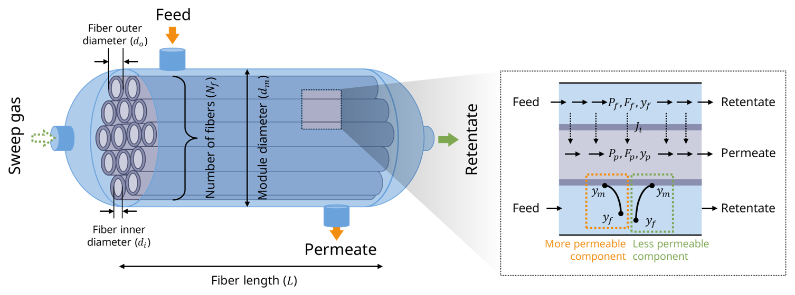
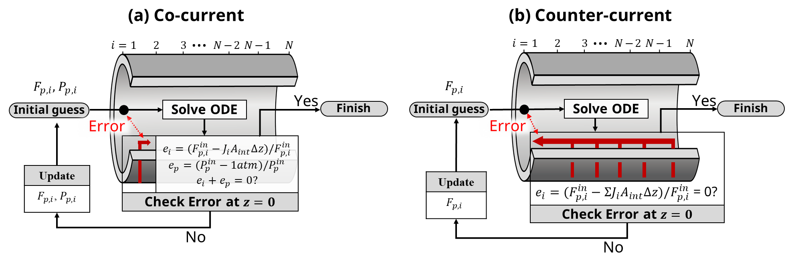

Process simulation and results analysis module
======================================================
The process simulation module features seven functions designed to define the hollow fiber membrane module and perform process simulation. Given the variety of parameters required for membrane process simulation, six functions are provided to facilitate easy input by categorizing them by feature. Additionally, the results analysis module features three functions designed to analyze and visualize the results obtained from the process simulation module. 

First, import module into Python after installation.

.. code-block:: python

   # Package import
   from pySembrane.simulator import *

Then users need to 7-steps to simulate, and additional two functions are used for results analysis.
    1. Membrane module design
    2. Membrane property information
    3. Gas property information 
    4. Mass transfer information
    5. Boundary condition setting
    6. Initial condition setting 
    7. Simulation run
    8. Results analysis

In next section, detailed steps are explained.

------------------------------------------------------

Usage
-------

1. Membrane module design
''''''''''''''''''''''''''''''''''''''''''''''

.. code-block:: python

    n_component = 4               # number of gas components
    configureation = 'CTFS'       # module configureation (Counter-current / feed-shell side)
    L = 0.6*1e3                   # fiber length (mm)
    D_module = 0.1*1e3            # Module diameter (mm)
    N_fiber = 60000               # number of fiber (-)

    N = 1000                      # number of nodes (-)

    Mem_proc = MembraneProc(configureation, L, D_module, N_fiber, 
                            n_component, n_node = N)
    print(Mem_proc)

2. Membrane property information
''''''''''''''''''''''''''''''''''''''''''''''

.. code-block:: python

    a_i = np.array([1.60e-11, 6.96e-12, 5.33e-13, 6.67e-13]) #Permeance(mol/(mm2 bar s))
    D_inner = 200*1e-3            # Membrane inner diameter (mm)
    D_outer = 250*1e-3            # Membrane outer diameter (mm)

    Mem_proc.membrane_info(a_i, D_inner, D_outer)
    print(Mem_proc)

3. Gas property information 
''''''''''''''''''''''''''''''''''''''''''''''

.. code-block:: python

    # Gas property
    Mw_i = np.array([2e-2, 44e-3, 16e-3, 28e-3])                 # molar weight (kg/mol)
    rho_i = np.array([0.08988, 1.98, 0.657, 1.14 ])*1e-9         # density (kg/mm3)
    mu_i = np.array([0.94e-5, 0.0155e-3, 0.011e-3, 1.83567e-5])  # viscosity (Pa s)

    Mem_proc.gas_prop_info(Mw_i, mu_i, rho_i)
    print(Mem_proc)

4. Mass transfer information
''''''''''''''''''''''''''''''''''''''''''''''

.. code-block:: python

    # Mass transfer property
    k_mass = 1e-1              # Mass transfer coeff. (mm/s)
    Mem_proc.mass_trans_info(k_mass)
    print(Mem_proc)

5. Boundary condition setting
''''''''''''''''''''''''''''''''''''''''''''''

.. code-block:: python

    # Boundary conditions
    P_feed = 20                                    # pressure of feed side (bar)
    T = 313.15                                     # temperature (K)
    F_feed = 0.03                                  # feed flow rate (mol/s)
    y_feed = np.array([0.75, 0.2, 0.04, 0.01])     # mole fraction (H2, CO2, CH4, CO)

    Mem_proc.boundaryC_info(y_feed, P_feed, F_feed, T)
    print(Mem_proc)

6. Initial condition setting 
''''''''''''''''''''''''''''''''''''''''''''''

.. code-block:: python

    # Initial condition
    Mem_proc.initialC_info()
    print(Mem_proc)

7. Simulation run
''''''''''''''''''''''''''''''''''''''''''''''

.. code-block:: python

    results = Mem_proc.run_mem()
    error = Mem_proc.MassBalance()

8. Results analysis
''''''''''''''''''''''''''''''''''''''''''''''

.. code-block:: python

    # Economic analysis parameters
    MODP = 10/1000000       # Total membrane module cost (USD/ft2)
    mem_life = 4            # membrane life (years)
    t = 5                   # project year (yr)
    r = 0.1                 # interest rate (%)
    R_gas = 8.314           # Gas constant (J/K mol)
    h_ratio = 1.4           # Heat capacity ratio (-)
    effi_ref = 0.8          # compressor efficiency (-)

    # total annual cost
    TAC = Mem_proc.CalculTAC(MODP, mem_life, t, r, h_ratio, effi_ref)   # USD/yr
    print(TAC, 'USD/yr')

    # energy consumption
    E_comp = Mem_proc._CalculCompr(h_ratio, effi_ref)       # kW
    print(E_comp[0], 'kW')

.. code-block:: python

    Mem_proc.PlotResults(component=['{H_2}','{CO_2}', '{CH_4}', '{CO}'])

Class documentation
----------------------------------

.. automodule:: pySembrane.simulator
    :special-members:
    :members:
    :member-order: bysource

---------------------------------

Theory
-------

Mathematical model for membrane process
''''''''''''''''''''''''''''''''''''''''''''''

  **Fig. 1** Membrane module system description.

The amount of material permeating through the membrane is governed by the difference of partial pressure between the feed and retentate sides as follows:

.. math::

    J_{i} = a_{i}\left(P_{f,i}-P_{p,i}\right) \ \mbox{where} \ P_{k,i} = y_{k,i}P_{k} \ \ \mbox{for} \ k=f \  \mbox{or} \ p

where :math:`J_{i}`, :math:`a_{i}` and :math:`P_{i}` denote the permeate flux, membrane permeance, and gas pressure for component :math:`i`, and subscript :math:`f` and :math:`p` mean feed and permeate side, respectively. Partial pressure for each side is determined by Dalton's law, where :math:`y_{i}` and `P` stands for the molar fraction of component :math:`i` and the total pressure of each side.
The component balance for each feed and permeate side is expressed as follows:

.. math::

    \frac{dF_{f,i}}{dz} = -J_{i}W_{int} \\

.. math::

    \frac{dF_{p,i}}{dz} = \begin{cases} J_{i}W_{int} \ \ \ \ \ \mbox{for co-current}\\
                            -J_{i}W_{int} \quad \mbox{for counter-current}
    \end{cases}

.. math::

    W_{int}=\pi d_{o}N

.. math::
  
    y_{k,i} = \frac{F_{k,i}}{\sum_{i}F_{k,i}} \ \ \mbox{for} \ k=f \  \mbox{or} \ p
  

where :math:`F`, :math:`W_{int}`, :math:`d_{o}`, and :math:`N` refer to the molar flowrate, the interfacial membrane width, the outer diameter of the hollow fiber membrane, and the total number of fibers, respectively. By solving equations, axial molar flowrates could be obtained. The molar fraction of each component is calculated using above equation.
Axial pressure variations are accounted for via pressure drop equations derived from the Hagen-Poiseuille equation for ideal gases, as follows:

**Shell-side pressure drop**

.. math::

    \frac{dP_f}{dz} = -\frac{192ND_o(D_m+ND_o)RT\mu_m}{\pi (D^{2}_{m}-ND^{2}_{o})^3P_f}F_{f}

.. math::

    \frac{dP_p}{dz} = \frac{128RT\mu_m}{\pi D^{4}_{i}NP_p}F_{p}

**Tube-side pressure drop**

.. math::

    \frac{dP_f}{dz} = -\frac{128RT\mu_m}{\pi D^{4}_{i}NP_f}F_{f}

.. math::

    \frac{dP_p}{dz} = \frac{192ND_o(D_m+ND_o)RT\mu_m}{\pi (D^{2}_{m}-ND^{2}_{o})^3P_p}F_{p}

A set of ordinary differential equations and pressure drop equations are solved using the following boundary conditions. For the feed stream, inlet conditions (at z = 0) are given:

.. math::

    P_{f} = P_{f}^{in} \ \mbox{at} \ z=0

.. math::

    F_{f,i} = y_{f,i}^{in}F_{f}^{in} \ \mbox{at} \ z=0

where superscript :math:`in` stands for the inlet condition for each factor. The derivative of the permeate flow rate is provided for each condition. For the co-current system without sweep gas, the flow rate of the permeate side equals the product of permeate flux and interfacial width for each component. Meanwhile, if the system contains sweep gas, the flow rate at the endpoint is the same with sweep gas (:math:`F_{sw}`).

.. math::

    F_{p,i} = \begin{cases} J_{i}W_{int} \ \ \ \ \ \mbox{without sweep gas}\\
                            F_{sw,i} \quad \mbox{with sweep gas}
    \end{cases}

On the other hand, the permeate flow rate at the exit (at z = 0) for the counter-current system is the integration of permeate flux along the axial direction, as follows:

.. math::

    F_{p,i} = \int_{z=0}^{z=L}J_{i}W_{int}dz + F_{sw,i}\ \ \mbox{at} \ z=0 \ \mbox{for counter-current}

Based on the assumption that the membrane process is modeled without a vacuum pump, permeate pressures at the exit could be assumed to be atmospheric, 1 atm, as follows:

.. math::

    P_{p} = 1 \mbox{atm}\ \ \mbox{at} \ z=L \ \mbox{for co-current}

.. math::

    P_{p} = 1 \mbox{atm}\ \ \mbox{at} \ z=0 \ \mbox{for counter-current}

Iterative algorithm for closed-end system
''''''''''''''''''''''''''''''''''''''''''''''

  **Fig. 2** A numerical algorithm proposed in this study.

The membrane separation process is defined by equations above is converted to algebraic equations through the finite difference method (FDM), and equations are solved by applying boundary conditions. Notably, the permeate side requires an iterative procedure to apply the boundary condition and solve differential equations simultaneously. Through the iterative method, :math:`F_{p,i}` and :math:`P_p` for the co-current mode, and :math:`F_{p,i}` for the counter-current can be obtained for boundary conditions. **Fig. 2** shows the algorithm for deriving unknown variables in each flow mode, involving a sequence of solving ODEs, calculating errors, and modifying boundary conditions. The iteration concludes when the sum of errors meets predefined criteria.

Before starting the algorithm, the initial boundary condition of the permeate side is established through guessing, varying based on the flow mode. Specifically, the initial values of :math:`F_{p,i}` and :math:`P_p` for the co-current mode was set to 10\ :sup:`-6` mol/s and 1.01 bar, respectively. For the counter-current mode, the initial value for :math:`F_{p,i}` is set to 0.05 :math:`F_{f,i}`. After solving the ODEs with the given boundary conditions, the flow rate for each side and gas component and the total pressure for each side are determined. Using the results, the relative error for each variable is computed by the following equations:

.. math::

    e_{i} = \begin{cases} \frac{\left( F_{p,i}^{in}-J_{i}W_{int}\Delta z\right)}{F_{p,i}^{in}}  \quad \quad \ \mbox{for co-current}\\
                        \frac{\left( F_{p,i}^{in}-\sum_{z} J_{i}W_{int}\Delta z\right)}{F_{p,i}^{in}} \quad \mbox{for counter-current}
    \end{cases}

.. math::

    e_{p} = \frac{\left(P_{p}^{in}-1 atm\right)}{P_{p}^{in}}

Here, :math:`e_{i}` represents the flow rate error of component :math:`i`, calculated by comparing the given boundary condition with the flow rate derived through flux at :math:`z=0`. The pressure error (:math:`e_{p}`) for the co-current mode is obtained by comparing the permeate side pressure with 1 bar, the boundary condition set at the outlet :math:`z=L`.

.. math::

    \mathbf{e} = \sum |e_i| + |e_p|

If the sum of the errors (:math:`\mathbf{e}`) falls below the predefined criteria, the computation process is terminated. Conversely, if the error surpasses the specified criteria, each variable is adjusted using the following equations:
    
.. math::

    \mathbf{x}^{new} = \mathbf{x}^{old}+\kappa e

Here, :math:`\mathbf{x}` refers to unknown variables, including :math:`F_{p,i}`, and :math:`P_p` at :math:`z=0`. :math:`\kappa` is a weight factor given by the user and takes a floating-point value between 0 and 1. This parameter allows a balance between convergence speed and computation stability. To elaborate, if :math:`\kappa` is too large, it could converge fast, but stability may decrease. In contrast, a smaller :math:`\kappa` may ensure stable convergence but at the cost of increased computation time due to a higher number of iterations. Using this user-defined parameter, users could adjust the trade-off between convergence speed and stability in their simulations with flexibility.

Techno-economic analysis of membrane process
''''''''''''''''''''''''''''''''''''''''''''''''''''''''''''''''''''''''''''''''''''''''''''''''''''''''

In the results analysis module of pySembrane, the total annual cost (TAC) of membrane-based separation processes can be determined using the :py:mod:`CalculTAC` function to analyze their economic feasibility. **Table 1**  lists the procedure for calculating TAC. TAC serves as a fundamental result for economic evaluations and can be extended for profitability analysis based on production cost per unit product or revenue from the product. The :py:mod:`CalculTAC` function computes the total capital investment (TCI) and total production cost (TPC) based on results from the process simulation module and user-input economic parameters, ultimately returning the TAC. TCI represents the sum of capital investments in the process, including installation costs for membrane modules and multistage compressor units, startup expenses, etc. The membrane module cost (MC) is derived from the membrane area obtained from membrane process design specifications multiplied by the user-input unit membrane cost. Additionally, the membrane replacement cost (MRC) is calculated based on MC, assuming replacement of 50 % of the membrane area every membrane life which is specified by the user. The compressor work and installed compressor cost (CC) for the multistage compressor unit are determined using the :py:mod:`_CalculCompr` function within the module, considering the feed pressure in the membrane process to determine the number of compressors and using user-input heat capacity ratios and compressor efficiency. Compressor work is multiplied by unit electricity cost to compute utility cost (UC). The calculated TCI is converted into the equivalent annual cost (EAC) using the project year and interest rate to derive the annuity factor (AF), which divides TCI to obtain EAC.\\

.. table:: **Table 1** Economic parameters for the total annual cost (TAC) to separate gas mixture using hollow fiber membrane process with multistage compressors.
    :align: center

    +-------------------------------------------+------------------------------+
    | **Total capital investment (TCI)**        | **TCI=TFI+SC**               |
    +-------------------------------------------+------------------------------+
    | Membrane module cost(MC)                  | $5/ft                        |
    +-------------------------------------------+------------------------------+
    | Installed compressor cost(CC)             | $8650*(W_{cp} /h_{cp} )^{η}  |
    +-------------------------------------------+------------------------------+
    | Fixed cost(FC)                            | MC+CC                        |
    +-------------------------------------------+------------------------------+
    | Base plant cost(BPC)                      | 1.12*FC                      |
    +-------------------------------------------+------------------------------+
    | Project contingency(PC)                   | 0.20*BPC                     |
    +-------------------------------------------+------------------------------+
    | Total facilities investment(TFI)          | BPC+PC                       |
    +-------------------------------------------+------------------------------+
    | Start up cost(SC)                         | 0.23*FC                      |
    +-------------------------------------------+------------------------------+
    | **Total production cost (TPC)**           | **TPC=CMC+LTI+DL+LOC+MRC+UC**|
    +-------------------------------------------+------------------------------+
    | Contract & material maintenance cost(CMC) | 0.015*TFI                    |
    +-------------------------------------------+------------------------------+
    | Local taxes and insurance(LTI)            | 0.015*TFI                    |
    +-------------------------------------------+------------------------------+
    | Direct labor cost(DL)                     | 0.59*TFI                     |
    +-------------------------------------------+------------------------------+
    | Labor overhead cost(LOC)                  | 1.15*DL                      |
    +-------------------------------------------+------------------------------+
    | Membrane replacement costs(MRC)           | 0.5*MC/t                     |
    +-------------------------------------------+------------------------------+
    | Utility cost(UC)                          | $0.071/kwh                   |
    +-------------------------------------------+------------------------------+
    | **Total annual cost (TAC)**               | **TAC=EAC+TPC**              |
    +-------------------------------------------+------------------------------+
    | Annuity factor(AF)                        | :math:`(1-(1+r)^{−yr})/r`    |
    +-------------------------------------------+------------------------------+
    | Equivalent annual cost(EAC)               | TCI/AF                       |
    +-------------------------------------------+------------------------------+
    | Membrane life(t)                          | 4 years                      |
    +-------------------------------------------+------------------------------+
    | Compressor efficiency(h_{cp} )            | 0.8                          |
    +-------------------------------------------+------------------------------+

