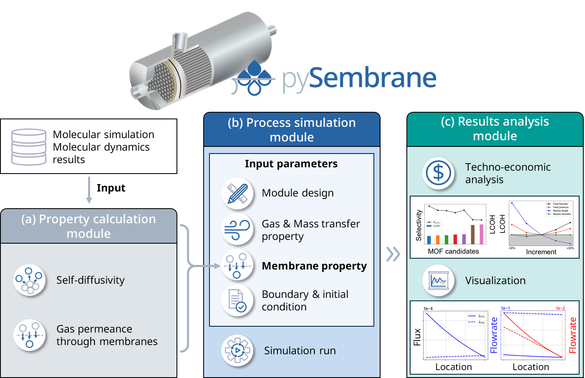

pySembrane
=============

**pySembrane** consists of three modules for **property calculation, process simulation, and results analysis**.The property calculation module calculates permeance, a crucial membrane property for process simulations. Permeance, which describes how gases move through the membrane, is expressed as a function of the membrane thickness, gas uptake, and self-diffusivity. The gas uptake and self-diffusivity could be derived from experiments or molecular simulations. The module provides additional functions to extract the self-diffusivity from molecular dynamics simulation results for easier permeance calculation. The process simulation module develops a hollow fiber membrane process and runs the simulation. Parameters related to the module design, gas and mass transfer, membrane properties, and boundary conditions are set with user-provided. In addition, the permeance calculated from the property calculation module could be used in the simulation. After the simulation was terminated, users could acquire simulation results, such as the mass flow rate, pressure, and composition along the z-axis. The results analysis module examines the economic feasibility of the process and visualizes simulation outcomes along the z-axis, leveraging data from the process simulation module. This module offers an easier assessment of the economic viability of various membrane materials and process parameters.

-------------

Usages, the function structure within the module, and the theory used are summarized for each module.

.. toctree::
   :maxdepth: 2
   :caption: Modules:

   Calculator
   SimulAnalyzer
   

----------------------------------------------------------------------------------------------------------------------------------------------------------------------