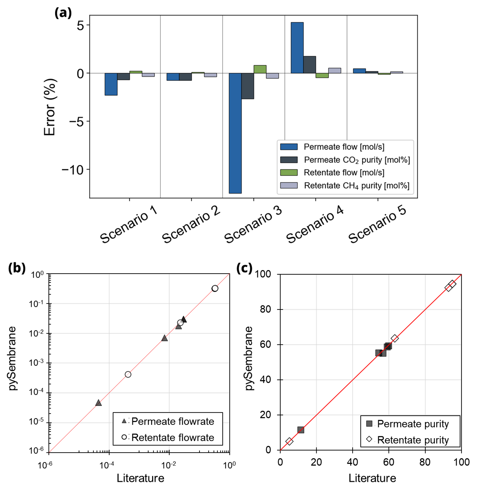

Validation of pySembrane
===================================

The validation of the proposed pySembrane was established through a comparative analysis of the literature. The target system for validation was CO$_2$ separation from a gas mixture, with pySembrane applied across five distinct scenarios. Of these, three scenarios were compared against results from the Matlab-based ChemBrane \cite{grainger2007simple} program, while the reliability of the remaining two was assessed by comparing outcomes with published literature data \cite{gu2022mathematical, he2018carbon}. Table \ref{tab:ValParameters} shows the parameter settings employed in the five scenarios.

+----------------------------------+----------+----------+----------+----------+-----------+
|                                  |            .. centered:: Scenario                     |
+==================================+==========+==========+==========+==========+===========+
|Parameters                        |        1 |        2 |        3 |        4 |        5  |
+----------------------------------+----------+----------+----------+----------+-----------+
|Temperature (T) [K]               |      308 |      308 |      308 |      298 |      315  |
+----------------------------------+----------+----------+----------+----------+-----------+
|Feed pressure (Pf) [bar]          |       35 |       35 |       15 |        5 |       20  |
+----------------------------------+----------+----------+----------+----------+-----------+
|Permeate pressure (Pp) [bar]      |        1 |        1 |        1 |        1 |        1  |
+----------------------------------+----------+----------+----------+----------+-----------+
|Feed flow (Ff) [mol/s]            |     0.35 |     0.35 |     0.35 | 4.46E-04 |     0.03  |
+----------------------------------+----------+----------+----------+----------+-----------+
|Sweep gas flow (Fsw) [mol/s]      |        - |        - |        - | 2.01E-05 |        -  |
+----------------------------------+----------+----------+----------+----------+-----------+
|Feed CO2 composition (yf) [mol%]  |       10 |       10 |       10 |       40 |       20  |
+----------------------------------+----------+----------+----------+----------+-----------+
|Feed CH4 composition (yf) [mol%]  |       90 |       90 |       90 |       60 |        4  |
+----------------------------------+----------+----------+----------+----------+-----------+
|Feed H2 composition (yf) [mol%]   |        - |        - |        - |        - |       75  |
+----------------------------------+----------+----------+----------+----------+-----------+
|Feed CO composition (yf) [mol%]   |        - |        - |        - |        - |        1  |
+----------------------------------+----------+----------+----------+----------+-----------+
|CO2 permeance [(mol/(m2 bar s)]   | 3.21E-04 | 3.21E-04 | 3.21E-04 | 8.41E-04 | 6.96E-06  |
+----------------------------------+----------+----------+----------+----------+-----------+
|CH4 permeance [(mol/(m2 bar s)]   | 1.33E-05 | 1.33E-05 | 1.33E-05 | 1.32E-05 | 5.33E-07  |
+----------------------------------+----------+----------+----------+----------+-----------+
|H2 permeance [(mol/(m2 bar s)]    |        - |        - |        - |        - | 1.60E-03  |
+----------------------------------+----------+----------+----------+----------+-----------+
|CO permeance [(mol/(m2 bar s)]    |        - |        - |        - |        - | 6.67E-07  |
+----------------------------------+----------+----------+----------+----------+-----------+
|N2 permeance [(mol/(m2 bar s)]    |        - |        - |        - | 3.97E-05 |        -  |
+----------------------------------+----------+----------+----------+----------+-----------+
|Module diameter (dm) [m]          |      0.1 |      0.1 |      0.1 | 1.20E-02 |      0.1  |
+----------------------------------+----------+----------+----------+----------+-----------+
|Fiber outer diameter (do) [mm]    |      0.2 |      0.2 |     0.17 |     0.15 |      0.2  |
+----------------------------------+----------+----------+----------+----------+-----------+
|Fiber inner diameter (di) [mm]    |     0.25 |     0.25 |     0.12 |      0.2 |     0.25  |
+----------------------------------+----------+----------+----------+----------+-----------+
|Fiber length (L) [m]              |      0.6 |      0.6 |      1.5 |      0.3 |      0.6  |
+----------------------------------+----------+----------+----------+----------+-----------+
|Number of fibers (Nf)             |   60,000 |   60,000 |   60,000 |      106 |   60,000  |
+----------------------------------+----------+----------+----------+----------+-----------+
|Module configuration              |     COFS |     CTFS |     CTFS |     CTFS |     CTFS  |
+----------------------------------+----------+----------+----------+----------+-----------+

The validation results are presented in Figure \ref{fig:ValidationError} and Table \ref{tab:ValidationResults}. In comparisons with ChemBrane, all scenarios—except for the permeate flow in scenario 3—showed errors below 5\%, indicating a strong similarity. Notably, the permeate flow in scenario 3 displayed a 12.48\% difference, because ChemBrane could not consider pressure drop in the system, unlike pySembrane. For Scenario 3, as the feed pressure decreases to 15 bar, the difference between the results of ChemBrane and pySembrane magnifies due to sensitivity to pressure drop. Additionally, while pySembrane exhibited an error exceeding 5\% in scenario 4, the results closely align with those reported in the literature, as demonstrated in the Figures \ref{fig:ValidationError} (b) and (c). This is because the measured value of permeate flow was too small, so the relative error reacts sensitively to little differences. On the other hand, in the overall comparison with the literature, the error was generally less than 5\%. This finding highlights how pySembrane provides results consistent with previous research, demonstrating its reliability.

+----------------+-----------------------+----------------------------+------------------------+------------------------------+
|                | Permeate flow (mol/s) | Permeate CO2 purity (mol%) | Retentate flow (mol/s) | Retentate CH4 purity (mol%)  |
+================+=======================+============================+========================+==============================+
|ChemBrane       |                  0.03 |                      59.12 |                   0.32 |                       94.77  |
+----------------+-----------------------+----------------------------+------------------------+------------------------------+
|pySembrane      |                0.0293 |                    58.7256 |                 0.3208 |                     94.4371  |
+----------------+-----------------------+----------------------------+------------------------+------------------------------+
|Difference (%)  |                 -2.28 |                      -0.67 |                   0.24 |                       -0.35  |
+----------------+-----------------------+----------------------------+------------------------+------------------------------+
|ChemBrane       |                  0.03 |                      59.88 |                   0.32 |                       94.94  |
+----------------+-----------------------+----------------------------+------------------------+------------------------------+
|pySembrane      |                0.0298 |                    59.4229 |                 0.3203 |                     94.5866  |
+----------------+-----------------------+----------------------------+------------------------+------------------------------+
|Difference (%)  |                 -0.76 |                      -0.76 |                   0.09 |                       -0.37  |
+----------------+-----------------------+----------------------------+------------------------+------------------------------+
|ChemBrane       |                  0.02 |                      56.72 |                   0.33 |                       92.92  |
+----------------+-----------------------+----------------------------+------------------------+------------------------------+
|pySembrane      |                0.0179 |                    55.2064 |                 0.3320 |                     92.4568  |
+----------------+-----------------------+----------------------------+------------------------+------------------------------+
|Difference (%)  |                -12.53 |                      -2.67 |                   0.80 |                       -0.50  |
+----------------+-----------------------+----------------------------+------------------------+------------------------------+
|Experiemental   |            4.464.E-05 |                      54.40 |             4.219.E-04 |                       63.30  |
+----------------+-----------------------+----------------------------+------------------------+------------------------------+
|pySembrane      |           4.6919.E-05 |                    55.3833 |            4.1963.E-04 |                     63.6336  |
+----------------+-----------------------+----------------------------+------------------------+------------------------------+
|Difference (%)  |                  5.10 |                       1.81 |                  -0.54 |                        0.53  |
+----------------+-----------------------+----------------------------+------------------------+------------------------------+
|Experiemental   |                 0.007 |                      11.50 |                  0.023 |                        5.16  |
+----------------+-----------------------+----------------------------+------------------------+------------------------------+
|pySembrane      |                0.0071 |                    11.5206 |                 0.0230 |                      5.1683  |
+----------------+-----------------------+----------------------------+------------------------+------------------------------+
|Difference (%)  |                  0.47 |                       0.18 |                  -0.11 |                        0.16  |
+----------------+-----------------------+----------------------------+------------------------+------------------------------+

---------